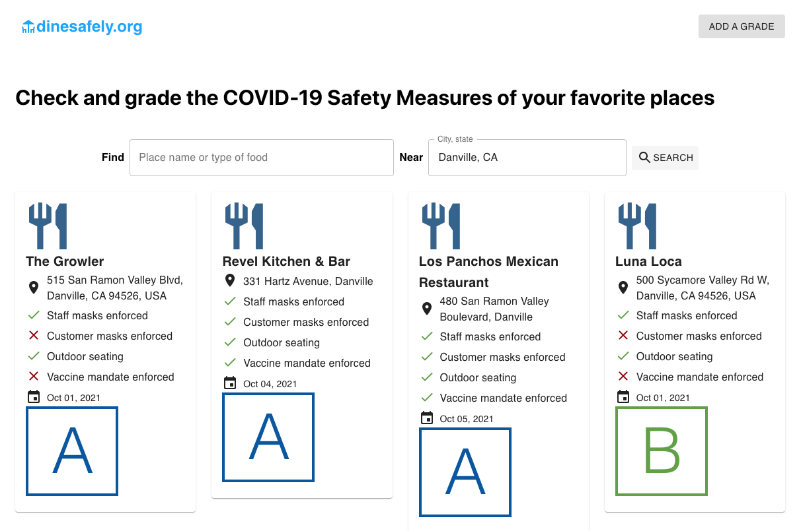
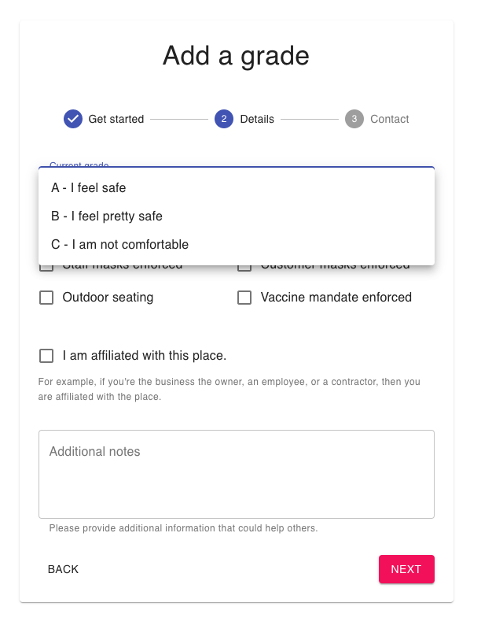

# DineSafely

Forked from whats-reopening-web project

https://github.com/narwhal-sightings/whats-reopening-web

**Dine Safely** is a webapp that lets you check and grade the COVID-19 Safety Measures of your favorite places

## Features

### Search places

It is a little like yelp (but very minimal) where you can select 
a city and optionally the name of a place or type of food to show 
ratings and grade A, B or C for a given place.



### Add a grade for a place

All you need is a valid email address to add a rating / grade for a
place. You must provide a grade:

* A - I feel safe
* B - I feel pretty safe
* C - I don't feel safe

And you should select whether the place adheres to 
masking and vaccine protocols and whether they have 
comfortable seating (from a covid transmission comfort
standpoint).

Upon posting, you'll receive an email with a one-time link which you 
click to complete and publish your grade.



## Stack

The webapp is built with React for the front-end and a REST API
using the Google Places API on the backend
(source at https://github.com/mrblog/dinesafely-api).
I’m using Material UI (v4) for the UI framework. Location data, is powered by Google Maps API.

### Shareable Links

Each filter that is applied is included as a URL parameter. The front page listens for changes to the URL to perform the appropraite query to the database. This allows users to share the places they are querying with others.

## Getting started

You'll need to create a `.env` file with the following settings:

```dotenv
REACT_APP_API_URL=<URL TO REST API>
REACT_APP_GA_PROPERTY=<GOOGLE ANALYTICS PROPERTY>
REACT_APP_MAPS_API_KEY=<GOOGLE API KEY>    
```

You can create a `.env.local` file to override settings for local testing, such as to point to a local instance of the backend API.
E.g.

```dotenv
REACT_APP_API_URL=http://localhost:8080/v1
```

### Install

```shell
npm install
```

### Start the app in development mode

```shell
npm start
```
